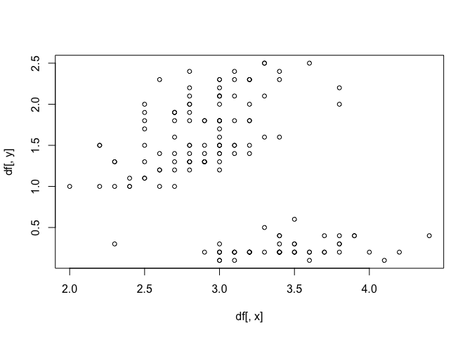

<!-- README.md is generated from README.Rmd. Please edit that file -->

# dataVision

<!-- badges: start -->

<!-- badges: end -->

The goal of dataVision is to easily plot data for fast visualization.

## Installation

You can install the released version of dataVision from
[CRAN](https://CRAN.R-project.org) with:

``` r
install.packages("dataVision")
```

## Example

This is a basic example which shows you how to use the dataVision function:

``` r
library(dataVision)
dataVision('Sepal.Width', 'Petal.Width', iris)
#> Plotting your data...stay tuned!

dataVision('speed', 'dist', cars)
```



How I made this R package
I first loaded in library devtools and created a tidy package.
```{r package code: creating the R package}
library(devtools)
create_tidy_package("~/Desktop/dataVision")
```
Next, I reloaded devtools and loaded the package using load_all() and use_git(). 
```{r package code: loading the R package}
library(devtools)
load_all()
use_git()
```
To create an r script for my function I used use_r("dataVision") then committed it. 

Following that, I updated the Description file manually adding a title, information about the author, and a description. Then I used use_mit_license("Adrienne Kinman") to update the license. 

Then I added a roxygen2 function to my dataVision function outlining the @param varaibles,  @return expected, @export and some @example code. A namespace file was created as part of this process. 

```{r package code: modifying the R package and adding documentation}
use_r("dataVision")
check()
use_mit_license("Adrienne Kinman")
```
Now, I added tests and dependencies to my R package. 
```{r package code: testing the R package and adding dependencies}
use_testthat("dataVision")
document()
use_package("testthat")
use_package("dplyr")
use_package("tidyverse")
use_pipe()
devtools::document()
```

Finally, I built the readme file and vignette. 
```{r package code: adding the readme and vignette files}
use_readme_rmd()
build_readme()
use_vignette("dataVision")
```
